Schema des paquets
==================

Schema des paquets du lobby
---------------------------

*les paquets GetInRoom, GetInRoomSucceed, GetOutRoom et GetOutRoomSucceed*
 *ont été respectivement remplacé par EnterRoom, EnterRoomSucceed, LeaveRoom et LeaveRoomSucceed*

Connexion lobby
^^^^^^^^^^^^^^^

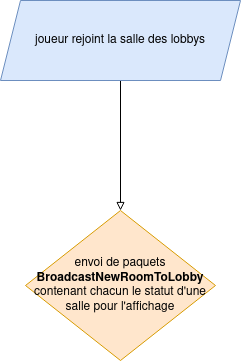

Rejoindre une salle
^^^^^^^^^^^^^^^^^^^

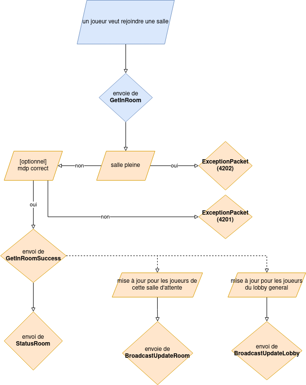

Quitter une salle
^^^^^^^^^^^^^^^^^

Creer une salle
^^^^^^^^^^^^^^^

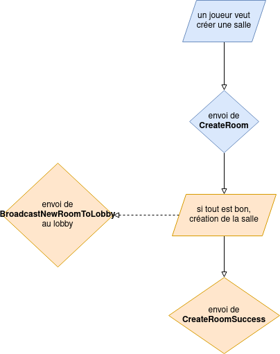

Supprimer une salle
^^^^^^^^^^^^^^^^^^^

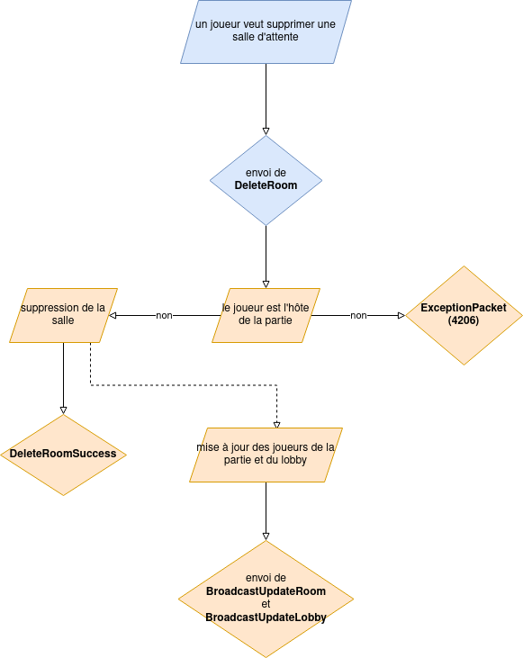

Ajouter un bot
^^^^^^^^^^^^^^

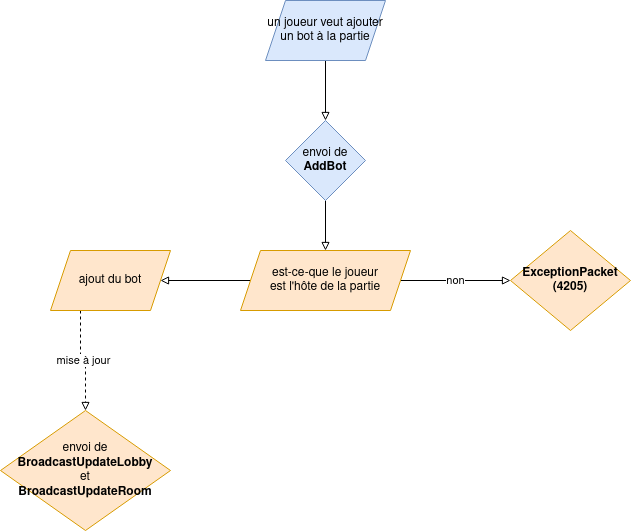

Lancer la partie
^^^^^^^^^^^^^^^^

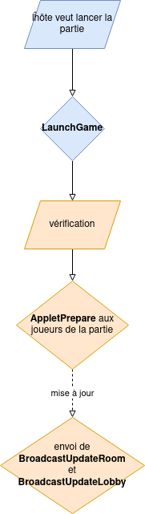

Schéma des paquets pour l'interaction avec unity.

Schema des paquets au démarrage
-------------------------------

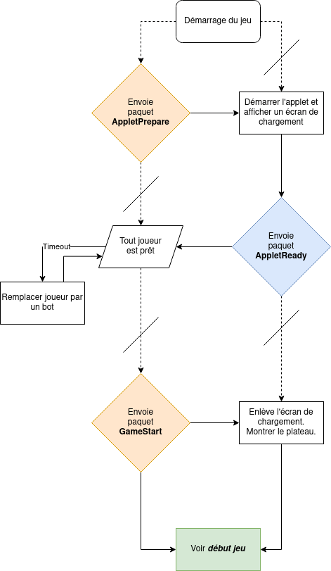

Schema des paquets début jeu
----------------------------

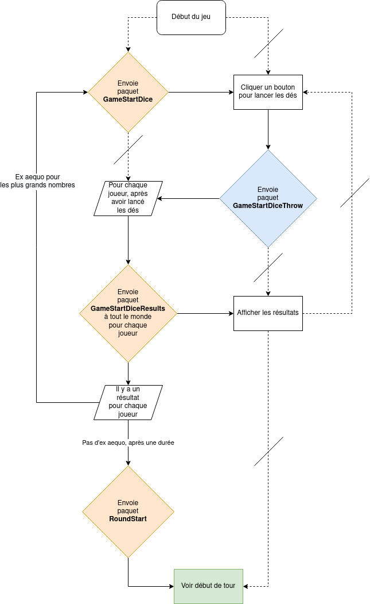

Schema des paquets début tour
-----------------------------

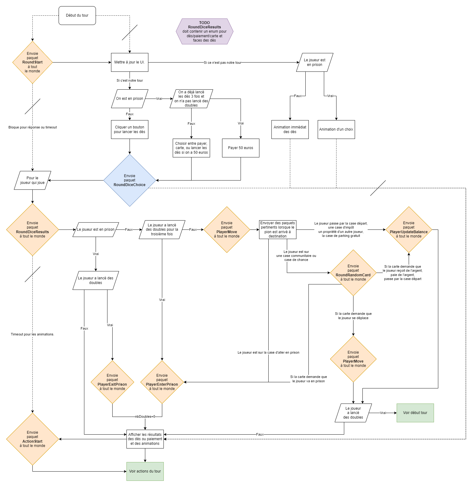

Schema des paquets actions de tour
----------------------------------

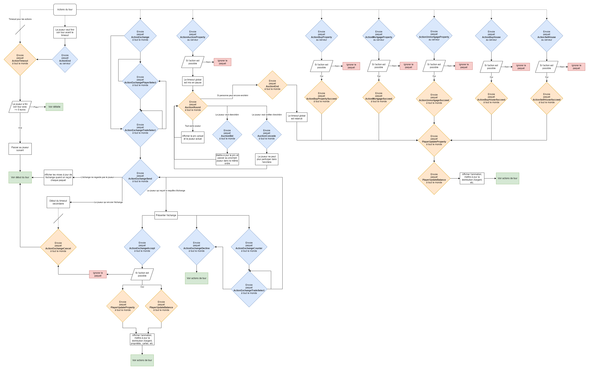

Schema des paquets de défaite
-----------------------------

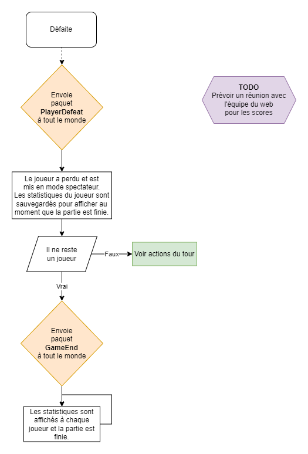

Schema des paquets de connexion
-------------------------------

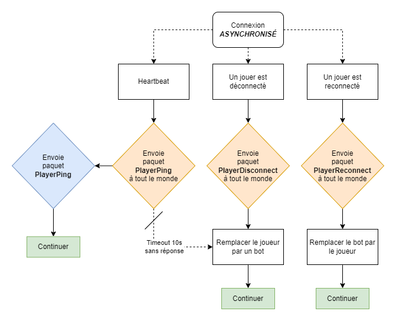

