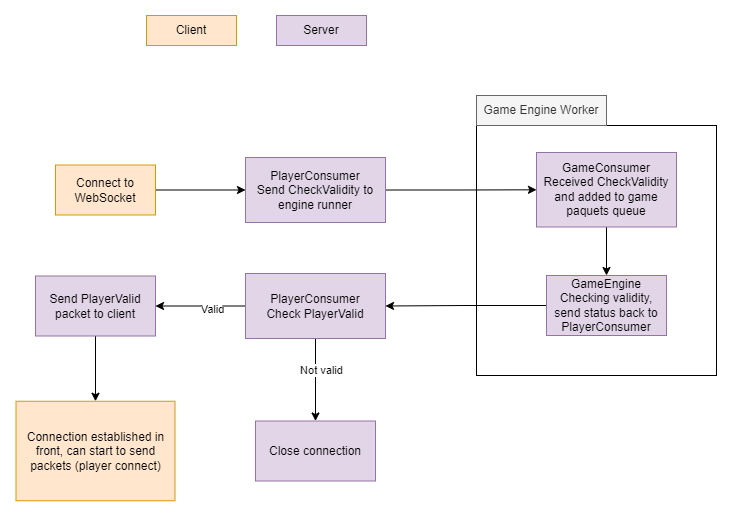

WebSockets
----------

.. Caution:: La documentation sera mise à jour en parallèle à la programmation des sockets.

Les websockets seront sécurisés, donc la manière dont il faudra s'y connecter sera la suivante:

.. code-block:: javascript
    :caption: Comment se connecter à un websocket

    let socket = new WebSocket("wss://url");

Socket du lobby
^^^^^^^^^^^^^^^

Socket de jeu
^^^^^^^^^^^^^

Trois arguments sont attendus pour se connecter au WebSocket du game engine.

.. code-block:: javascript
    :caption: Comment se connecter au websocket du game engine

    let socket = new WebSocket("wss://localhost/ws/game/<uuid:game_id>/<uuid:player_token>?jwt=<jwt>");

Echange pour valider la connexion
---------------------------------

